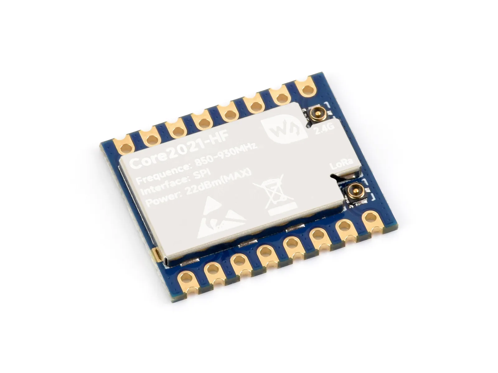

# Waveashre Core2021-XF Product Engineering Sample Program

[中文](README_ZH.md)

Core2021-XF integrates the fourth-generation LoRa® multi-band transceiver Semtech LR2021, supporting Sub-GHz bands (410–510 MHz / 850–930 MHz), the 2.4 GHz ISM band, and licensed bands from 1.5 to 2.5 GHz. It also features FLRC modulation, with data rates of up to 2.6 Mbps..

- [Purchase Link](https://www.waveshare.com/Core2021-XF.htm)
- [Documentation](https://docs.waveshare.com/Core2021-XF)

---

## 🔧 Configuration

You can find detailed configuration information on the product wiki page

---

## 🛠️ Contributing

We welcome contributions! Here’s how you can help:

1. Fork the repository.
2. Create a new branch for your feature or bug fix.
3. Commit your changes with clear descriptions.
4. Submit a pull request for review.

---

## 🧩 Issues and Support

If you encounter any issues:

- Check the [Issues](https://github.com/waveshare/core2021-xf/issues) section.
- Create a new issue with detailed information.
- Refer to the documentation for troubleshooting tips.
- Contact the Waveshare team and provide the order number to obtain technical support.

---

## 📜 License

This repository is licensed under the Apache License License. See the [LICENSE](LICENSE) file for details.

---

## 🙌 Acknowledgments

- Waveshare for their excellent hardware platforms and software support
- The Espressif Team for their continuous support.
- Open-source contributors who make these projects possible.

---

Thank you for using Waveshare Electronics Products! 🚀